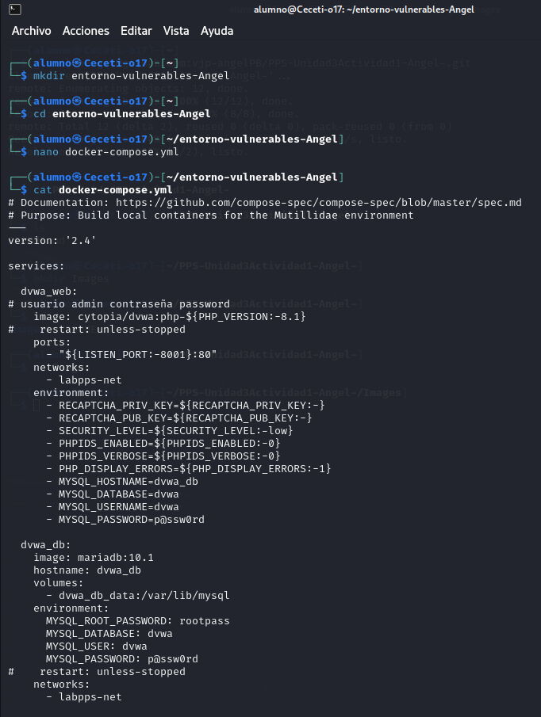
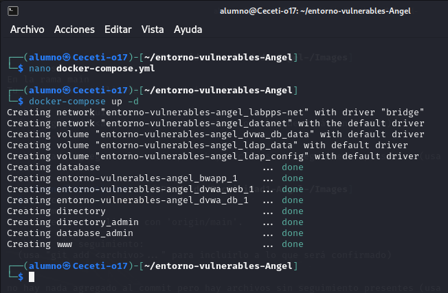

# PPS-Unidad3Actividad1-Angel-

Actividad 1 de la Unidad 3 de Puesta en Producción Segura. Trabajaremos creando entornos de pruebas.

Tenemos varios objetivos:

> [Crear entorno de máquinas vulnerables](#Entorno-de-maquinas-vulnerables)

> [Crear un entorno de pruebas de vulnerabilidades](#Entorno-de-pruebas)

---
## Entorno de maquinas vulnerables

Entre la información de fuentes abiertas hemos comprobado que existen proyectos creados con máquinas vulnerables para que podamos practicar con ellas.


Entre los diferentes proyectos podemos encontrar los siguientes:

1. [DAMN VULNERABLE WEB APPLICATION \(DVWA\)](https://github.com/digininja/DVWA/blob/master/README.es.md) 
2. [Buggy Web APPlication \(BWAPP\)](http://www.itsecgames.com/) 
3. [OWASP Multillidae II](https://owasp.org/www-project-mutillidae-ii/)

Para ello tan sólo tenemos que realizar los siguientes pasos:

1. Crea una carpeta con nombre entorno-vulnerables-tunombre
2. Colocar dentro de ella el archivo [docker-compose.yml](./entornoMaquinasInseguras/docker-compose.yml) que tienes en la carpeta entornoMaquinasInseguras de este repositorio



Es necesario eliminar las siguientes líneas, (```kali:
    image: jmmedinac03/kali_pps
    hostname: kali
    cap_add:
      - NET_ADMIN
    stdin_open: true
    tty: true
    volumes:
      - ./kali-volume:/root/kali
    networks:
      - labpps-net```)
  
3. Levantar el escenario multicontedor con `docker-compose up -d`




## Entorno de pruebas

Para la realización de las prácticas, vamos a crear servidores y archivos con vulnerabilidades presentes para posteriormente corregirlas.

Tenemos diferentes opciones para realizarlo, entre ellas:

- Crear una máquina virtual e instalar todo lo necesario: Una pila sea del tipo que sea: LAMP, LEMP, MEAN, XAMPP, WAMP y AMPPS.

- Crear un escenario multicontenedor con cualquiera de esas pilas.

En esta ocasión vamos a utilizar la segunda opción. Crearemos un escenario multicontenedor con cualquiera de las pilas que podemos encontrar en [docker hub](https://hub.docker.com). 

Yo he utilizado la primera que me he encontrado:[https://github.com/sprintcube/docker-compose-lamp.git](https://github.com/sprintcube/docker-compose-lamp.git)


### Instalación
> En el repositorio de github.com, el usuario __sprintcube__ nos indica las operaciones que tenemos que hacer para replicar el escenario:

```shell
git clone https://github.com/sprintcube/docker-compose-lamp.git
cd docker-compose-lamp/
cp sample.env .env
// modify sample.env as needed
docker compose up -d
// visit localhost
```

A continuación, ejecutamos `docker compose up -d`.


> Ángel Pérez Blanco
