# PPS-Unidad3Actividad1-Angel-

Actividad 1 de la Unidad 3 de Puesta en Producción Segura. Trabajaremos creando entornos de pruebas.

Tenemos varios objetivos:

> [Crear entorno de máquinas vulnerables](#Entorno-de-maquinas-vulnerables)

> [Crear un entorno de pruebas de vulnerabilidades](#Entorno-de-pruebas)

---
## Entorno de maquinas vulnerables

Entre la información de fuentes abiertas hemos comprobado que existen proyectos creados con máquinas vulnerables para que podamos practicar con ellas.


Entre los diferentes proyectos podemos encontrar los siguientes:

1. [DAMN VULNERABLE WEB APPLICATION \(DVWA\)](https://github.com/digininja/DVWA/blob/master/README.es.md) 
2. [Buggy Web APPlication \(BWAPP\)](http://www.itsecgames.com/) 
3. [OWASP Multillidae II](https://owasp.org/www-project-mutillidae-ii/)

Para ello tan sólo tenemos que realizar los siguientes pasos:

1. Crea una carpeta con nombre entorno-vulnerables-tunombre
2. Colocar dentro de ella el archivo [docker-compose.yml](./entornoMaquinasInseguras/docker-compose.yml) que tienes en la carpeta entornoMaquinasInseguras de este repositorio


Es necesario eliminar las siguientes líneas, (```kali:
    image: jmmedinac03/kali_pps
    hostname: kali
    cap_add:
      - NET_ADMIN
    stdin_open: true
    tty: true
    volumes:
      - ./kali-volume:/root/kali
    networks:
      - labpps-net```)
  
3. Levantar el escenario multicontedor con `docker-compose up -d`


En este punto ya tenemos las máquinas creadas, a continuación, vamos a verificar las máquinas vulnerables que hemos creado:

- DVWA
Para acceder a esta máquina buscamos __http://localhost:8001__, es posible que tarde en crear la base de datos o que de error en la BBDD.

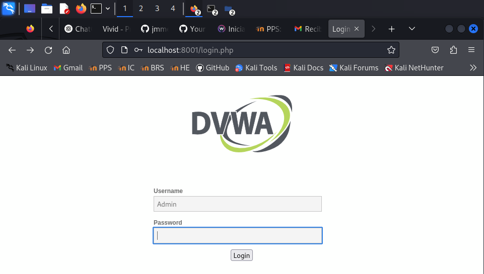

Accedemos con usuario Admin y sin contraseña

Al igual que en bWAPP que veremos a continuación, el primer paso será crear la Base de Datos.

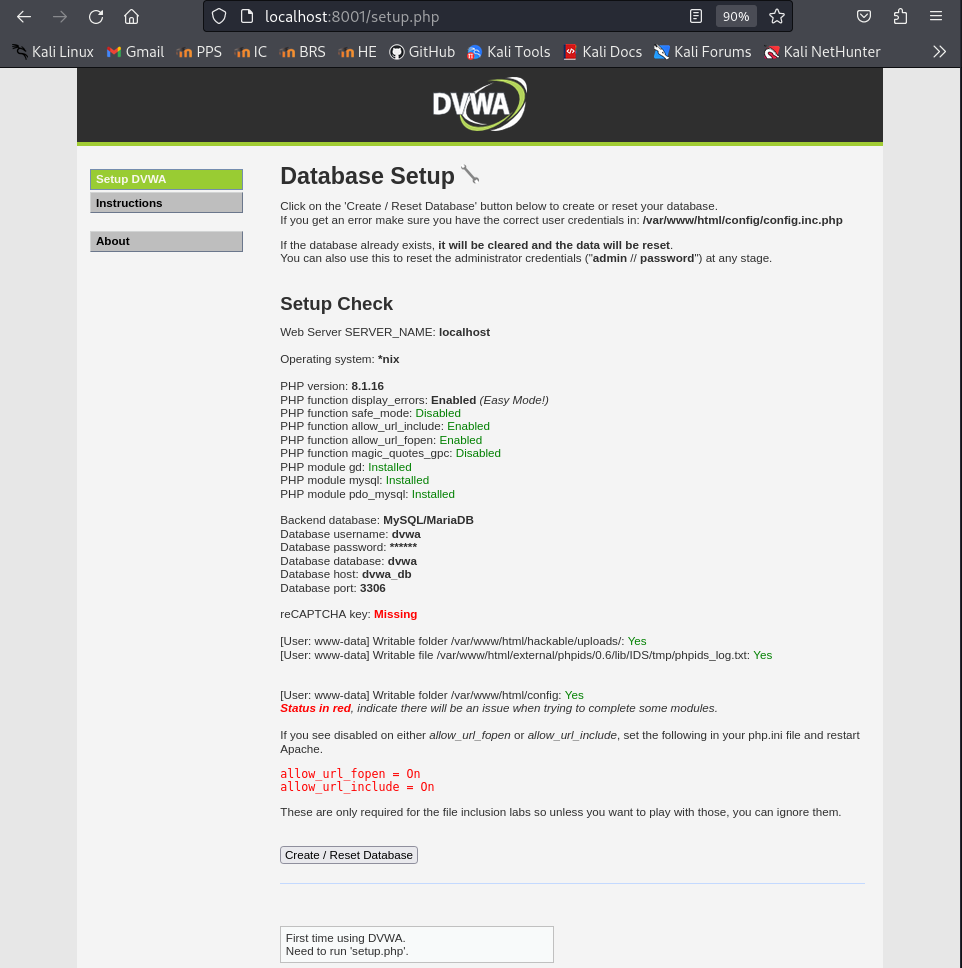

A continuación, con el usuario Admin y la contraseña password podemos realizar los retos que queramos.

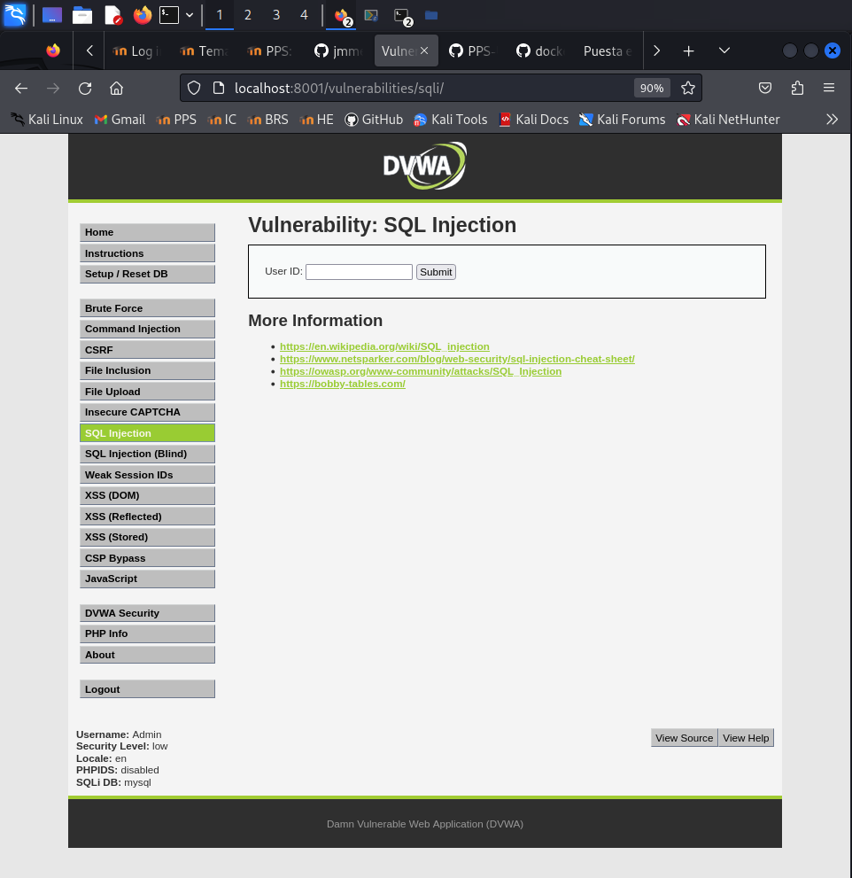

---

- bWAPP
Para acceder a esta máquina buscamos __http://localhost:8002__, aunque la primera vez que accedamos mostrará un error ya que no tiene creada la BBDD.

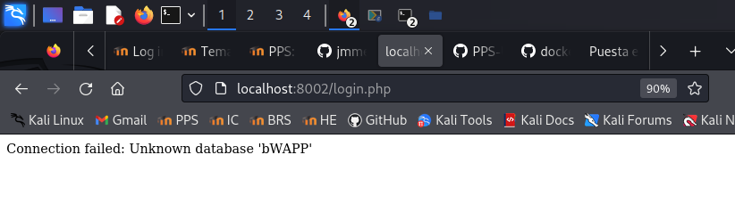


Debemos acceder a crear la BBDD: __http://localhost:8002/install.php__

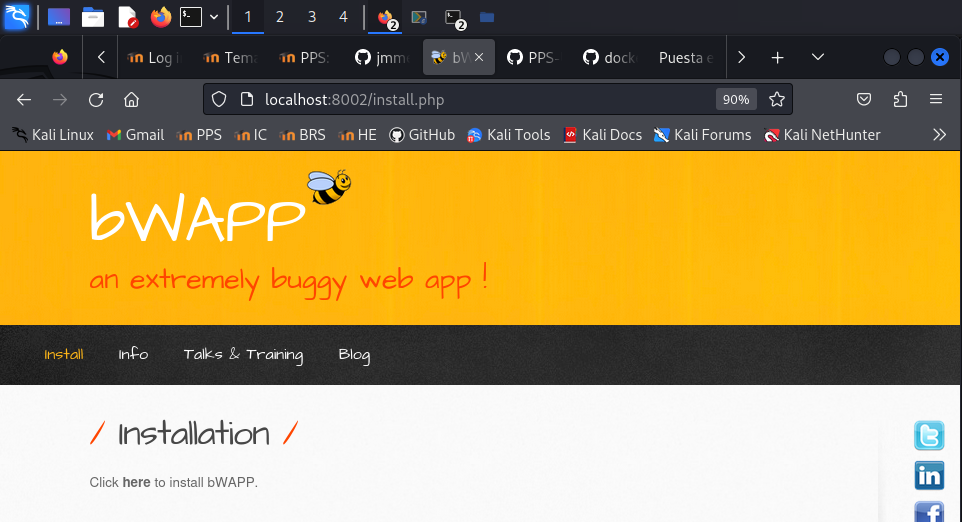

Y ya podremos acceder pulsando en login o creando un nuevo usuario. 
Existen credenciales de acceso por defecto, son usuario: bee, contraseña: bug
A continuación podemos seleccionar el nivel de seguridad que queremos que tenga la máquina.

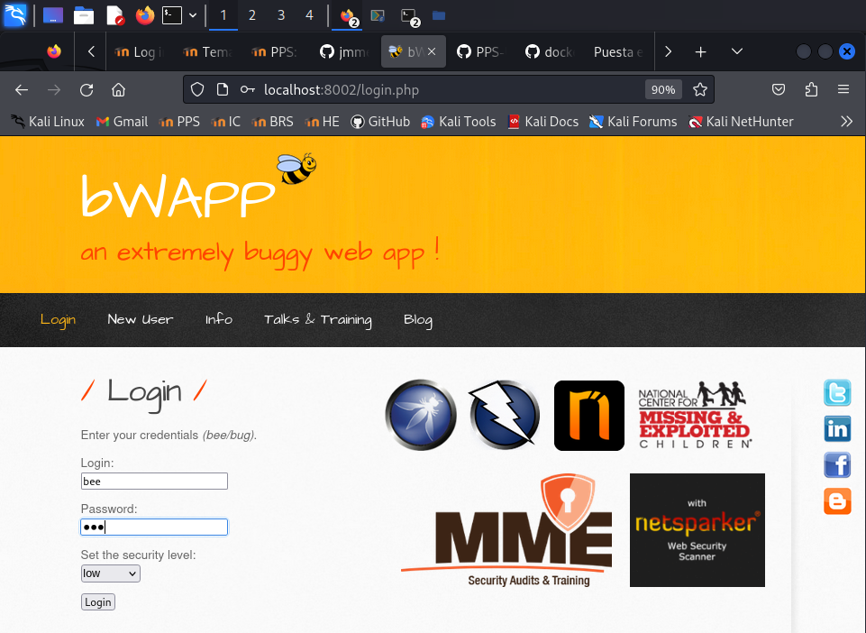

Tras haber accedido, podemos realizar diferentes entrenamientos de explotación de vulnerabilidades.

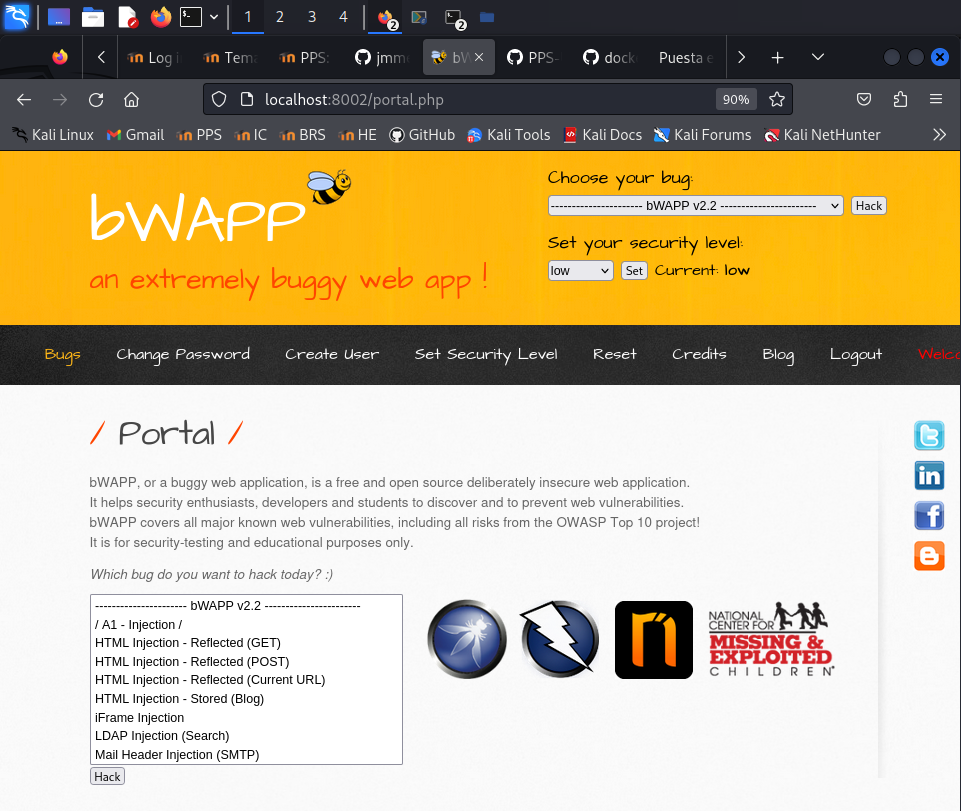


- Multillidae ii

Para entrar a esta máquina accedemos a través del puerto 80 0 8080, __http://localhost:80__,o __http://localhost:8080__.

Al igual que en los casos anteriores, el primer paso será crear la Base de Datos.

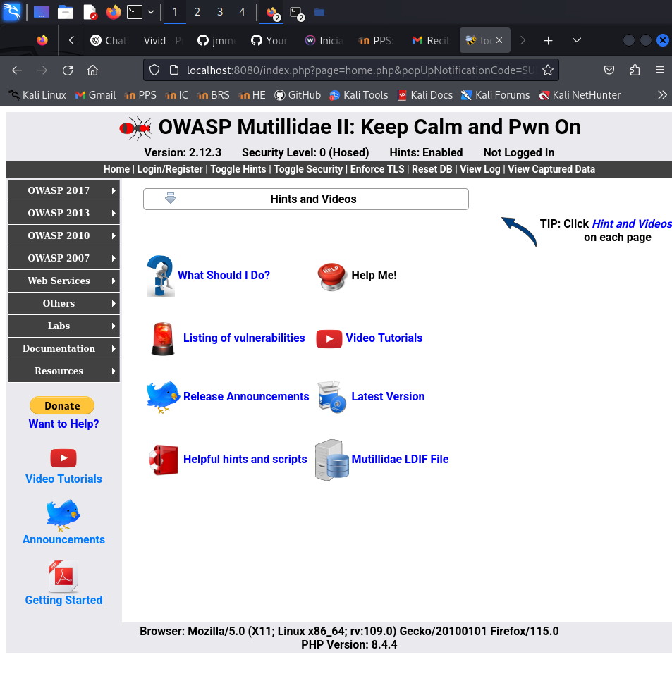

En este caso no necesitamos usuario y contraseña para acceder.

En multillidae tenemos además del servicio de BBDD otros servicios creados:

* Servicio PhpAdmin para acceder a las BBDD.
  Accedemos desde http://localhost:81. 

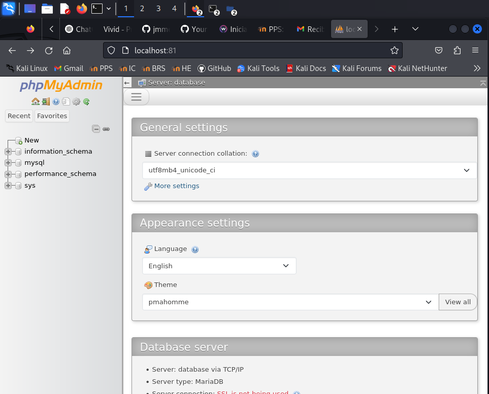

* Servicio PhpLdapAdmin para acceder al servicio de directorio LDAP.
  Accedemos desde http://localhost:82. 

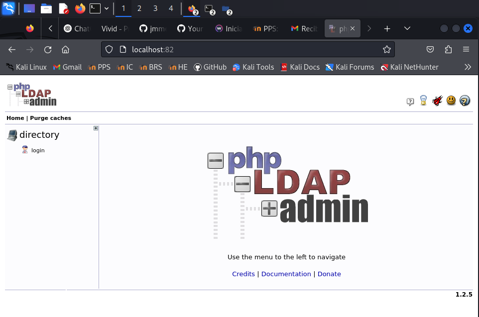

    
## Entorno de pruebas

Para la realización de las prácticas, vamos a crear servidores y archivos con vulnerabilidades presentes para posteriormente corregirlas.

Tenemos diferentes opciones para realizarlo, entre ellas:

- Crear una máquina virtual e instalar todo lo necesario: Una pila sea del tipo que sea: LAMP, LEMP, MEAN, XAMPP, WAMP y AMPPS.

- Crear un escenario multicontenedor con cualquiera de esas pilas.

En esta ocasión vamos a utilizar la segunda opción. Crearemos un escenario multicontenedor con cualquiera de las pilas que podemos encontrar en [docker hub](https://hub.docker.com). 

Yo he utilizado la primera que me he encontrado:[https://github.com/sprintcube/docker-compose-lamp.git](https://github.com/sprintcube/docker-compose-lamp.git)


### Instalación
> En el repositorio de github.com, el usuario __sprintcube__ nos indica las operaciones que tenemos que hacer para replicar el escenario:

```shell
git clone https://github.com/sprintcube/docker-compose-lamp.git
cd docker-compose-lamp/
cp sample.env fichero_config.env
```

Modificamos el fichero_config.env y cambiamos los valores por defecto como puertos, usuarios, contraseñas, nombre base de datos:

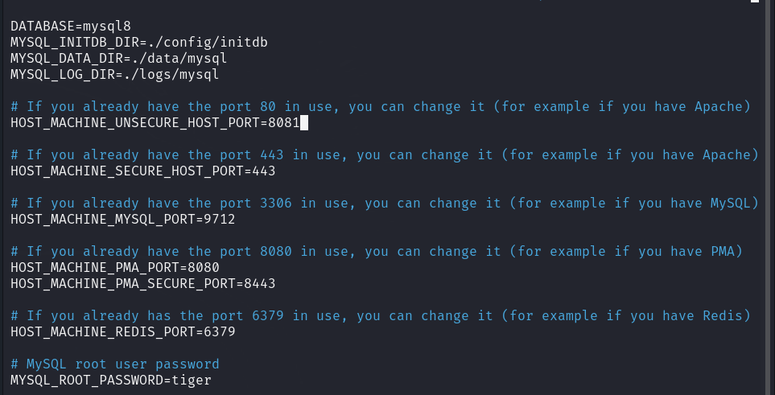

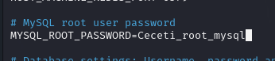

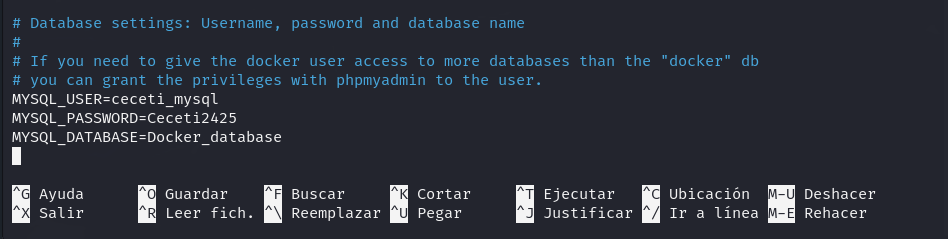


```
docker-compose up -d
```

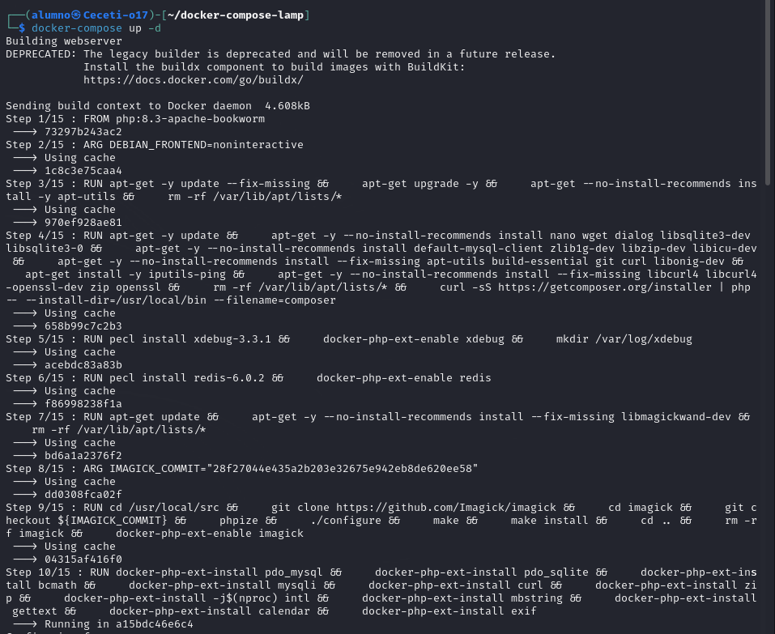

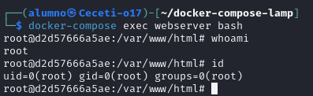


> Ángel Pérez Blanco
